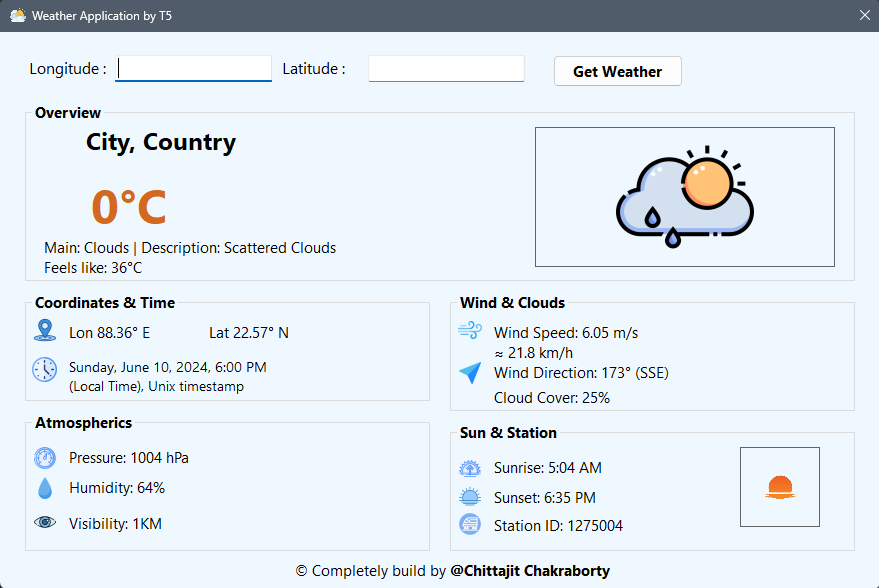

# 🌤️ Windows Weather App By T5

A clean, modern, and highly organized desktop weather forecasting application built for Windows. This application provides comprehensive, real-time meteorological data based on geographic coordinates, featuring an intuitive and easily scannable user interface.



## 🚀 Features

- **Precise Location Tracking:** Input exact **Longitude** and **Latitude** coordinates to fetch instantaneous, accurate local weather data.
- **Dynamic Weather Overview:** Displays the target City and Country alongside prominent real-time temperature tracking and detailed "Feels Like" metrics.
- **Comprehensive Data Dashboards:**
  - 📍 **Coordinates & Time:** Local time, Unix timestamp, and precise coordinate mapping.
  - 🌧️ **Atmospherics:** Live tracking of Atmospheric Pressure (hPa), Humidity (%), and Visibility (KM).
  - 💨 **Wind & Clouds:** Granular details including Wind Speed (m/s & km/h), Wind Direction (degrees & cardinal), and Cloud Cover percentages.
  - 🌅 **Sun & Station:** Sunrise/Sunset time tracking and meteorological Station ID reporting.

## 🛠️ Tech Stack

- **Framework:** C# / .NET Windows Desktop Application
- **UI Design:** Custom minimalist layout prioritizing data readability and thematic data blocks
- **Data Integration:** External Weather API fetching and JSON parsing

## 📥 Getting Started

### Prerequisites
- Windows 10/11
- Visual Studio (with .NET desktop development workload installed)
- An active API key from your chosen weather data provider (e.g., OpenWeatherMap)

### Installation & Setup

1. **Clone the repository:**
   ```bash
   git clone [https://github.com/Tatai47/Windows-Weather-App-By-T5.git](https://github.com/Tatai47/Windows-Weather-App-By-T5.git)